<!-- ========================================================= -->

<!--                   PRAVEEN // SYSTEM                       -->

<!-- ========================================================= -->

<div align="center">



<br/>

<code>AI SYSTEMS</code>
 •  <code>EXPERIMENTAL SOFTWARE</code>
 •  <code>PRODUCT ENGINEERING</code>
 •  <code>BUILDING THE UNLIKELY</code>

<br/><br/>

<sup>PRAVEEN NIMILKA // SYSTEM ONLINE</sup>

</div>

---

```console
visitor@github:~$ ssh praveen@mind
connecting...
handshake complete.
access granted.

Welcome to PRAVEEN/OS.
Type `help` to explore.
```

## `> help`

```text
AVAILABLE COMMANDS
──────────────────────────────────────────────────────────

./whoami        identify operator
./mission       current objective
./lab           enter experimental projects
./telemetry     live GitHub system information
./stack         inspect technology stack
./processes     inspect active ideas
./principles    read operating principles
./contributions visualize build history
./brain         enter restricted area

──────────────────────────────────────────────────────────
STATUS: ONLINE
```

---

<details open>
<summary><code>visitor@github:~$ ./whoami</code></summary>

<br/>

```yaml
operator:
  name: "Praveen Nimilka"
  type: "builder"

mode:
  - research
  - prototype
  - break
  - understand
  - rebuild
  - ship

interests:
  - artificial intelligence
  - experimental software
  - product engineering
  - AI infrastructure
  - automation
  - developer tools
  - creative technology

current_state: "BUILDING"
```

I like building things somewhere between:

```text
possible ──────────────────────────────── impossible
                         ▲
                         │
                   interesting zone
```

The projects I enjoy most usually begin with:

> **"I don't know if this is possible... but what happens if we try?"**

</details>

---

<details>
<summary><code>visitor@github:~$ ./mission</code></summary>

<br/>

```text
MISSION CONTROL
────────────────────────────────────────────────────────────

01 // REMOVE COMPLEXITY

     complicated workflow
              │
              ▼
       ┌─────────────┐
       │  rethink it │
       └──────┬──────┘
              │
              ▼
          one action


02 // EXPERIMENT

     IDEA
       │
       ▼
     BUILD
       │
       ▼
     BREAK
       │
       ▼
   UNDERSTAND
       │
       ▼
    REBUILD


03 // SHIP

     experiments are useful.
     working products are better.

────────────────────────────────────────────────────────────
```

</details>

---

## `> ./telemetry`

<div align="center">


</div>

<sup>
↑ Generated automatically from GitHub every 12 hours.
</sup>

---

<details>
<summary><code>visitor@github:~$ cd ./lab</code></summary>

<br/>

```text
PRAVEEN LABS
──────────────────────────────────────────────────────────────

drwxr-xr-x    citeshield/
drwxr-xr-x    aether/
drwxr-xr-x    ai-infrastructure/
drwxr-xr-x    one-click/
drwxr-xr-x    experiments/

5 directories detected.
```

### `01 // CITESHIELD`

```text
type      : citation intelligence
state     : beta
objective : make academic-document auditing faster and safer
```

```text
          DOCUMENT
              │
              ▼
      ┌──────────────┐
      │  CITESHIELD  │
      └───────┬──────┘
              │
     ┌────────┼────────┐
     │        │        │
     ▼        ▼        ▼
 citations   DOI    references
     │        │        │
     └────────┼────────┘
              ▼
        EVIDENCE ENGINE
              │
              ▼
          AUDIT REPORT
```

---

### `02 // PROJECT AETHER`

```text
type      : neural physical sandbox
state     : experimental
objective : explore AI-defined physical worlds
```

```text
"corrosive liquid star"
          │
          ▼
   NATURAL LANGUAGE
          │
          ▼
      AI MODEL
          │
          ▼
    PHYSICAL DNA
          │
          ▼
  PARTICLE BEHAVIOR
          │
          ▼
    EMERGENT WORLD
```

---

### `03 // AI INFRASTRUCTURE`

```text
type      : systems research
state     : researching

questions:

> can AI training become dramatically more efficient?
> how much computation can move onto ordinary hardware?
> can memory become more important than brute-force compute?
> are current training architectures actually the final form?
```

```text
research/
│
├── efficient-training
├── memory-systems
├── local-ai
├── distributed-compute
├── model-optimisation
├── unconventional-architectures
└── probably-something-that-will-break-my-pc
```

---

### `04 // ONE-CLICK SOFTWARE`

My favourite product challenge:

```text
BEFORE

[ upload ]
    ↓
[ configure ]
    ↓
[ select ]
    ↓
[ clean ]
    ↓
[ process ]
    ↓
[ export ]
    ↓
[ fix ]
    ↓
[ repeat ]


AFTER

┌──────────────────────┐
│                      │
│        DO IT         │
│                      │
└──────────────────────┘

            ↓

         DONE.
```

</details>

---

<details>
<summary><code>visitor@github:~$ ./stack --inspect</code></summary>

<br/>

<div align="center">


</div>

<br/>

```text
STACK INSPECTOR
───────────────────────────────────────────────────────

LANG        Python       ███████████████░
            JavaScript   ██████████████░░
            TypeScript   █████████████░░░

WEB         React
            Next.js
            Node.js

AI          PyTorch
            TensorFlow
            LLM APIs
            neural experiments

DATA        PostgreSQL
            Supabase

SYSTEMS     Docker
            Linux
            Git
            GitHub Actions

SHIP        Vercel

───────────────────────────────────────────────────────
```

</details>

---

<details>
<summary><code>visitor@github:~$ ps aux | grep ideas</code></summary>

<br/>

```text
PID    CPU    MEM    PROCESS
────────────────────────────────────────────────────────────

001    91%    42%    build_ai_product
002    76%    31%    research_random_idea
003    99%    63%    why_is_this_not_working
004    88%    41%    rebuild_from_scratch
005    52%    28%    maybe_this_is_a_startup
006    69%    33%    optimize_everything
007    100%   95%    start_another_project

────────────────────────────────────────────────────────────

WARNING:

process 007 cannot be terminated.
```

</details>

---

<details>
<summary><code>visitor@github:~$ cat principles.sys</code></summary>

<br/>

```text
┌────────────────────────────────────────────────────────────┐
│ 01                                                        │
│                                                            │
│ BUILD > TALK                                               │
│                                                            │
├────────────────────────────────────────────────────────────┤
│ 02                                                        │
│                                                            │
│ SIMPLE INTERFACE                                           │
│ DOES NOT MEAN                                              │
│ SIMPLE ENGINEERING                                         │
│                                                            │
├────────────────────────────────────────────────────────────┤
│ 03                                                        │
│                                                            │
│ FAILURE                                                    │
│ IS                                                         │
│ DATA                                                       │
│                                                            │
├────────────────────────────────────────────────────────────┤
│ 04                                                        │
│                                                            │
│ SMALL EXPERIMENTS                                          │
│ CAN BECOME                                                 │
│ VERY LARGE IDEAS                                           │
│                                                            │
├────────────────────────────────────────────────────────────┤
│ 05                                                        │
│                                                            │
│ IF IT SOUNDS SLIGHTLY IMPOSSIBLE,                          │
│ INVESTIGATE IT.                                            │
│                                                            │
└────────────────────────────────────────────────────────────┘
```

</details>

---

## `> ./contributions --animate`

<div align="center">


</div>

```text
CONTRIBUTION GRID ONLINE.

each square = something built,
broken,
learned,
or shipped.
```

---

<details>
<summary><code>visitor@github:~$ sudo ./brain</code></summary>

<br/>

```text
[sudo] password for visitor: ************

authenticating...
████████████████████████████████████ 100%

ACCESS GRANTED.


/dev/brain
──────────────────────────────────────────────────────

current thoughts:

[01] can this become 10x simpler?

[02] can AI do this locally?

[03] why does this require seven buttons?

[04] there must be a better architecture.

[05] wait...

[06] this could actually work.

[07] create_new_repository()


──────────────────────────────────────────────────────

WARNING:

The operator has detected another project idea.
```

</details>

---

<div align="center">

<br/>

```text
            ┌───────────────────────────────┐
            │                               │
            │   WHAT IF WE ACTUALLY TRIED? │
            │                               │
            └───────────────────────────────┘
```

<br/>

<code>PRAVEEN NIMILKA</code>

<br/>

<sub>AI × SOFTWARE × EXPERIMENTS</sub>

<br/><br/>

```text
visitor@github:~$ exit

connection closed.

█
```

</div>
